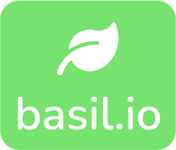

<!-- PROJECT LOGO -->
 

  

<h3 align="center">[WIP] basil.io</h3>

  

    A custom-built home-server solution.
     
  

 

<!-- TABLE OF CONTENTS -->

  
Table of Contents

  <ol>
    <li>
      <a href="#about-the-project">About The Project</a>
      <ul>
        <li><a href="#built-with">Built With</a></li>
      </ul>
    </li>
    <li>
      <a href="#getting-started">Getting Started</a>
      <ul>
        <li><a href="#prerequisites">Prerequisites</a></li>
        <li><a href="#installation">Installation</a></li>
      </ul>
    </li>
    <li><a href="#roadmap">Features</a></li>
    <li><a href="#contact">Contact</a></li>
  </ol>

<!-- ABOUT THE PROJECT -->
## About The Project

Ever since watching a Raspberry Pi video for the first time, I've always wanted to try and build something with one. When <a href='https://www.youtube.com/watch?v=QdHvS0D1zAI'>this video by Jeff Delaney's Fireship</a> came out, I knew a home-server build was in my future. Given that I also wanted to learn Docker and Tailwind for a long time now, I figured "Why not just combine all those into one project?". And so, **basil.io** was born.

### Built With

* [Next.js](https://nextjs.org/)
* [Express.js](https://expressjs.com/)
* [Docker](https://www.docker.com/)
* [Tailwind](https://tailwindcss.com/)

<!-- GETTING STARTED -->
## Getting Started 🔜

### Prerequisites 🔜

### Installation 🔜

<!-- ROADMAP -->
## Feature List 🔜

<!-- CONTACT -->
## Contact

Author: Manuel Fideles  
Linkedin: [manuel-fideles](https://www.linkedin.com/in/manuel-fideles/)  
Project Link: [basil-io](https://github.com/manelfideles/basil-io)

(<a href="#top">back to top</a>)
